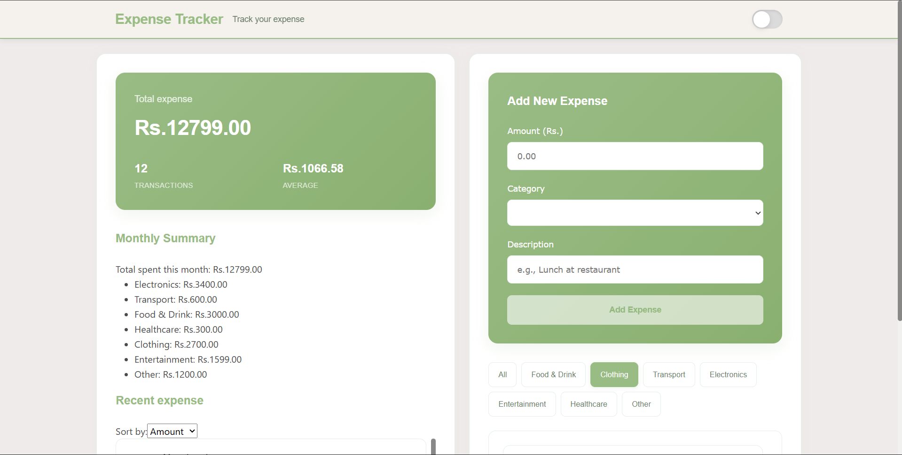
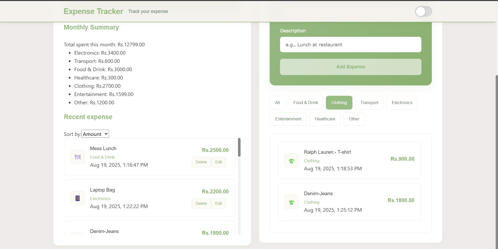
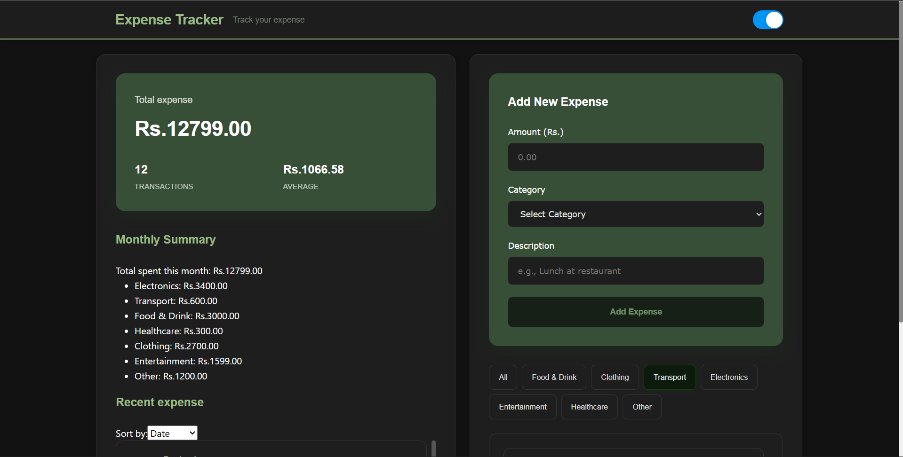
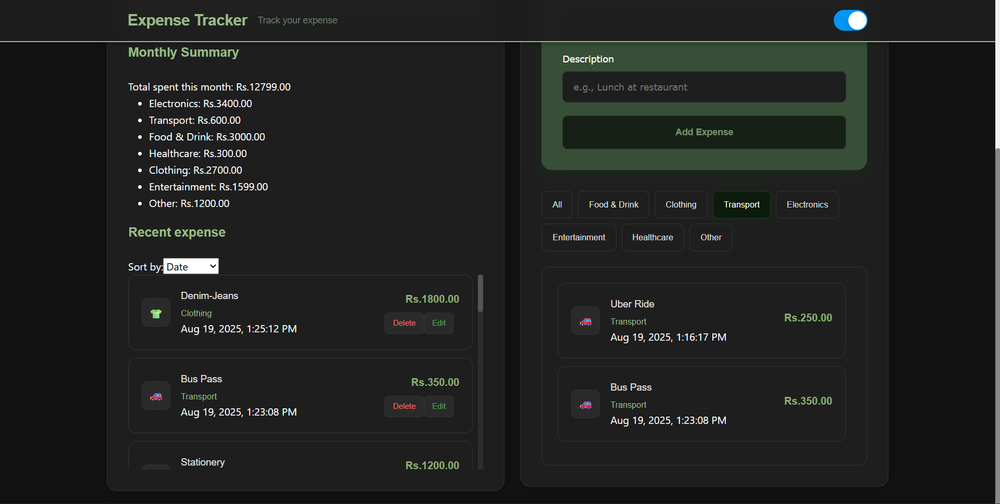

# Expense Tracker - Angular + Spring Boot + PostgreSQL

A modern expense tracking application built with Angular frontend and Spring Boot backend, featuring a responsive design with Bootstrap and dark mode support.

## 🚀 Features

- **💰 Expense Management**: Add, edit, delete, and track expenses
- **📊 Real-time Statistics**: Total amount, transaction count, and average calculations
- **📅 Monthly Summary**: Category-wise breakdown of current month expenses
- **🔍 Filtering & Sorting**: Filter by category and sort by date, amount, or category
- **🌙 Dark Mode**: Toggle between light and dark themes
- **📱 Responsive Design**: Works perfectly on desktop, tablet, and mobile
- **💾 Database Integration**: PostgreSQL database with JPA/Hibernate
- **🔄 RESTful API**: Complete CRUD operations via REST endpoints

## 🛠️ Technology Stack

### Frontend
- **Angular 20**: Modern TypeScript framework
- **Bootstrap 5**: Responsive CSS framework
- **NgBootstrap**: Angular Bootstrap components
- **RxJS**: Reactive programming

### Backend
- **Spring Boot 3.5.4**: Java framework
- **Spring Data JPA**: Database abstraction
- **PostgreSQL**: Relational database
- **Maven**: Build tool

## 📋 Prerequisites

Before running this application, make sure you have the following installed:

- **Node.js** (v18 or higher)
- **Angular CLI** (v20 or higher)
- **Java JDK** (v17 or higher)
- **Maven** (v3.6 or higher)
- **PostgreSQL** (v12 or higher)

## 🚀 Quick Start

### 1. Database Setup

1. Install PostgreSQL and create a database:
   ```sql
   CREATE DATABASE expense_db;
   ```

2. Update database credentials in `src/main/resources/application.properties`:
   ```properties
   spring.datasource.password=YOUR_POSTGRES_PASSWORD
   ```

### 2. Backend Setup

1. Navigate to the project root:
   ```bash
   cd yashh/yash
   ```

2. Build and run the Spring Boot application:
   ```bash
   mvn clean install
   mvn spring-boot:run
   ```

3. The backend will start on `http://localhost:8080`

### 3. Frontend Setup

1. Navigate to the Angular project:
   ```bash
   cd back-frontend
   ```

2. Install dependencies:
   ```bash
   npm install
   ```

3. Start the development server:
   ```bash
   ng serve
   ```
4. Open your browser and navigate to `http://localhost:4200`

## 📁 Project Structure

```
yashh/yash/
├── src/main/java/com/example/yash/     # Spring Boot backend
│   ├── Expense.java                    # Entity class
│   ├── ExpenseController.java          # REST API controller
│   ├── ExpenseService.java             # Business logic
│   ├── ExpenseRepository.java          # Data access layer
│   └── YashApplication.java            # Main application class
├── src/main/resources/
│   ├── application.properties          # Database configuration
│   └── static/                         # Static files (old frontend)
├── back-frontend/                      # Angular frontend
│   ├── src/app/
│   │   ├── components/                 # Angular components
│   │   │   └── expense-tracker/        # Main expense tracker component
│   │   ├── services/                   # Angular services
│   │   │   └── expense.service.ts      # API communication service
│   │   ├── models/                     # TypeScript interfaces
│   │   │   └── expense.model.ts        # Expense data models
│   │   └── app.component.*             # Main app component
│   ├── src/assets/                     # Static assets
│   └── package.json                    # Angular dependencies
└── pom.xml                            # Maven configuration
```

## 🔌 API Endpoints

| Method | Endpoint | Description |
|--------|----------|-------------|
| GET | `/api/expenses` | Get all expenses |
| GET | `/api/expenses/{id}` | Get expense by ID |
| POST | `/api/expenses` | Create new expense |
| PUT | `/api/expenses/{id}` | Update expense |
| DELETE | `/api/expenses/{id}` | Delete expense |

### Example API Usage

```bash
# Get all expenses
curl http://localhost:8080/api/expenses

# Create new expense
curl -X POST http://localhost:8080/api/expenses \
  -H "Content-Type: application/json" \
  -d '{
    "amount": 25.50,
    "category": "food",
    "description": "Lunch at restaurant"
  }'
```

## 🎨 Features in Detail

### Expense Categories
- 🍽️ Food & Drink
- 👕 Clothing
- 🚗 Transport
- 📱 Electronics
- 🎬 Entertainment
- 🏥 Healthcare
- 📋 Other

### Statistics Dashboard
- Total expenses amount
- Number of transactions
- Average expense per transaction
- Monthly category breakdown

### Filtering & Sorting
- Filter expenses by category
- Sort by date (newest first)
- Sort by amount (highest first)
- Sort by category (alphabetical)

### Dark Mode
- Toggle between light and dark themes
- Persistent theme preference
- Optimized for both themes

## 🔧 Development

### Adding New Features

1. **Backend Changes**:
   - Add new fields to `Expense.java`
   - Update service methods in `ExpenseService.java`
   - Add new endpoints in `ExpenseController.java`

2. **Frontend Changes**:
   - Update TypeScript interfaces in `expense.model.ts`
   - Modify component logic in `expense-tracker.component.ts`
   - Update template in `expense-tracker.component.html`

### Building for Production

1. **Build Angular**:
   ```bash
   cd back-frontend
   ng build --configuration production
   ```

2. **Copy to Spring Boot**:
   ```bash
   cp -r dist/* ../src/main/resources/static/
   ```

3. **Build Spring Boot**:
   ```bash
   mvn clean package
   ```

4. **Run JAR**:
   ```bash
   java -jar target/yash-0.0.1-SNAPSHOT.jar
   ```

---
## Email
- **Name:-** *Yash Javanjal*
- **Email:-** *yashjavanjal2512*
- **GitHub:-** Yash-Javnjal

-----

## ScreenShots:-
### Light Mode:-


-


---
### Dark Mode:-

-

---


